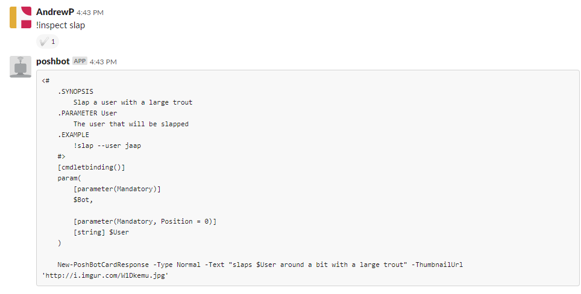

# Poshbot.Inspect

PoshBot plugin to return the definition of functions.

This module contains 1 command named `Inspect-Command` with an alias of `inspect`.

## Install Module

To install the module from the PowerShell Gallery:

```powershell
PS > Install-Module -Name PoshBot.Inspect -Repository PSGallery
```

## Install Plugin

To install the plugin from within PoshBot:

`!install-plugin -name poshbot.inspect`

## Example

### Slack



### Teams

~[Inspect in Teams](TeamsExample.png)
